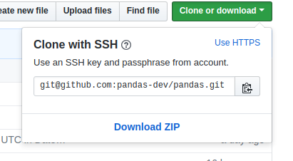
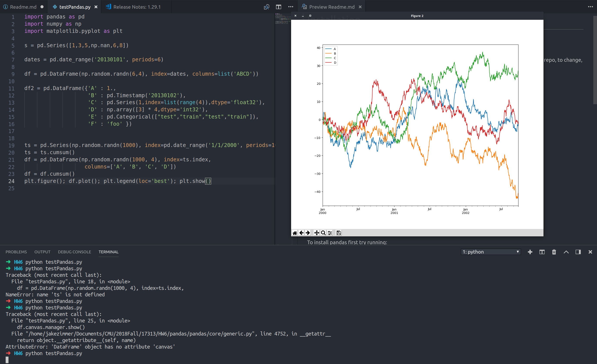

# Installation

## Github
I know we all know how to use github but I noticed a new thing on github that sometimes happens so I decided to note it here: github now defaults to ssh for cloning a repo. To change, hit the little "Use HTTPS" in the top corner. 



## Actually installing Dependencies

Just run this: 

`pip install numpy python-dateutil pytz cython`
## Installing Pandas

To install pandas first try running:

`python setup.py develop`

Honestly theres a pretty good chance that this wont work and you'll get an error like this:
```
[Errno 13] Permission denied: '/usr/local/lib/python2.7/dist-packages/test-easy-install-11825.write-test'
```
When it doesn't work, just try rerunning it with the following command (theres a potentially better way using python-envs but try this first):

```
sudo python setup.py develop
```

Once that's done you should get a message:

```
Finished processing dependencies for pandas==0.24.0.......
```

## More Dependencies

Here are some more dependencies which, while not required to build, are what the pandas dev team really likes to use in their examples and documentation.
```
SciPy: miscellaneous statistical functions, Version 0.14.0 or higher

xarray: pandas like handling for > 2 dims, needed for converting Panels to xarray objects. Version 0.7.0 or higher is recommended.

PyTables: necessary for HDF5-based storage. Version 3.0.0 or higher required, Version 3.2.1 or higher highly recommended.

matplotlib: for plotting, Version 1.4.3 or higher.
```
## If all goes well . . .

If everything goes well, you should be able to run this test script (python testPandas.py) that I compiled from code snippets on their website and get something like this:

